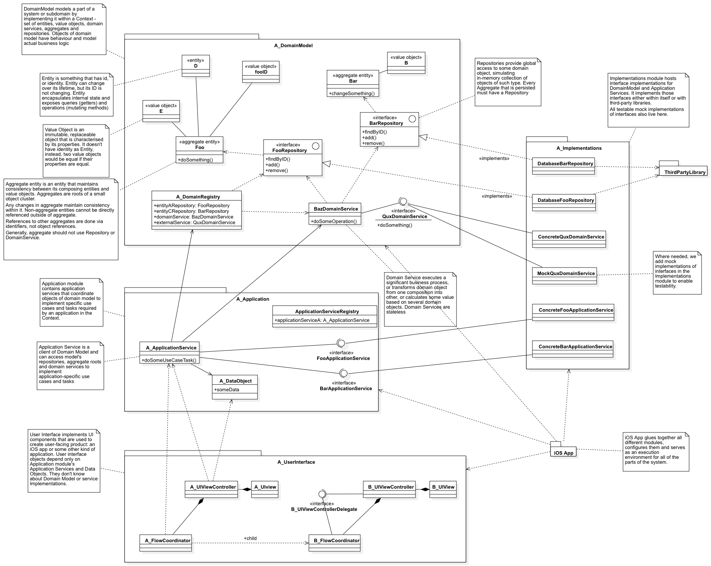
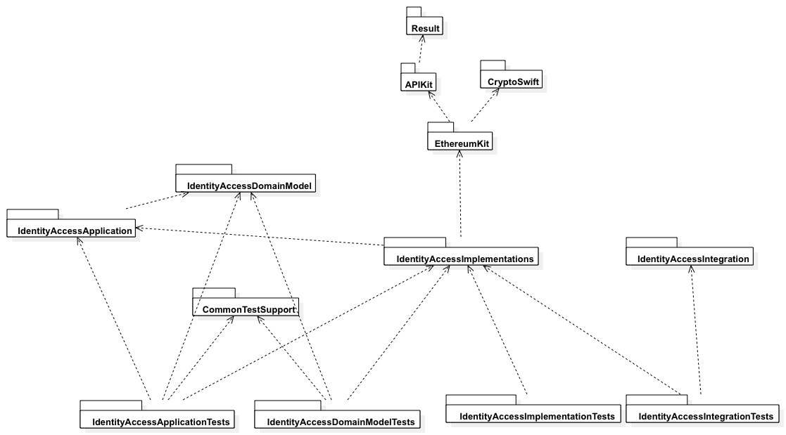
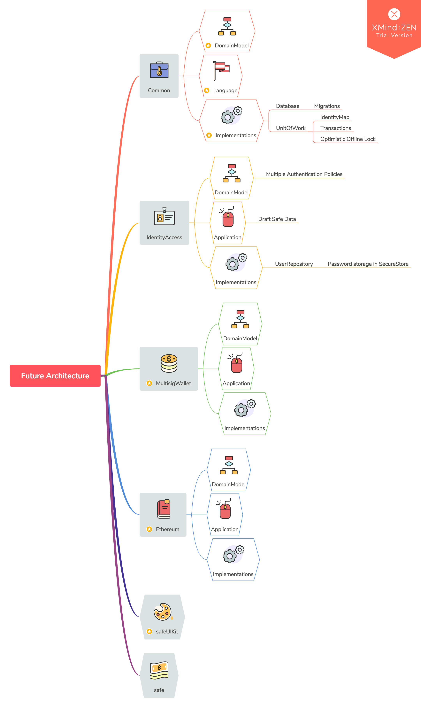

============
Architecture
============

The architecture follows a hexagonal high-level architecture pattern. Currently, there are the following modules, from high-level to low-level.

* safe iOS app
* safeUIKit - components used in the app.
* IdentityAccess - user and authentication related components.

  - IdentityAccessApplications - implementations of use-cases using domain model objects
  - IdentityAccessDomainModel - domain model objects. All business logic lives here.
  - IdentityAccessImplementations - implementations of external services and repositories of domain model and application modules.

* Common - common code.

  - CommonTestSupport - common code used in tests.

Architectural Types
-------------------

From the UI perspective, the app consists of View Controllers that talk to Application Services to display data and perform use case tasks. 

Routing logic between view controllers is handled through Flow Coordinators that also may talk to Application Services to make decisions which controllers to present.

Application Services are coordinating incoming actions to invoke appropriate methods on the Domain Model objects. 
Application Services are stateless. 
Application Services send data back to clients using Data Objects, such as DraftSafe.

Domain Model objects are entities, value objects, domain services and repositories. Entities are types with identity and behavior, that may change over their lifetime.
Value Objects are types that hold value but not identity, they are replacable with objects with the same properties, and they are immutable.
Domain Services are used to implement complex operations involving many entities or complex busines processes; they are stateless.
Repositories provide access to collections of domain objects.

From high-level perspective, a subdomain implementation woudl involve the following modules (libraries and frameworks):

.. image:: png/TypicalArchitecture_High_Level.png

The more detailed class diagram below shows typical classes used in the architecture.

Current Architecture
--------------------

The figure below shows safe's current archtiecture. Libraries, frameworks and iOS app are shown in hexagons. Further lines detail important class relationships.

.. image:: png/CurrentArchitecture.png

The app's module dependency graph looks like this:

.. image:: png/Model__Dependencies_1.png

The testing targets also depend on various modules. Here's the graph for IdentityAccess project tests:

And the one for safe and safeUIKit tests:

.. image:: png/Model__SafeTests_2.png

Future Architecture
-------------------

In the following release we will add 2 more contexts for 2 subomains: Ethereum and MultisigWallet. Ethereum would be responsible for all the tasks related to blockchain, while MultisigWallet will be responsible for wallet application logic.

The figure below shows future components.

